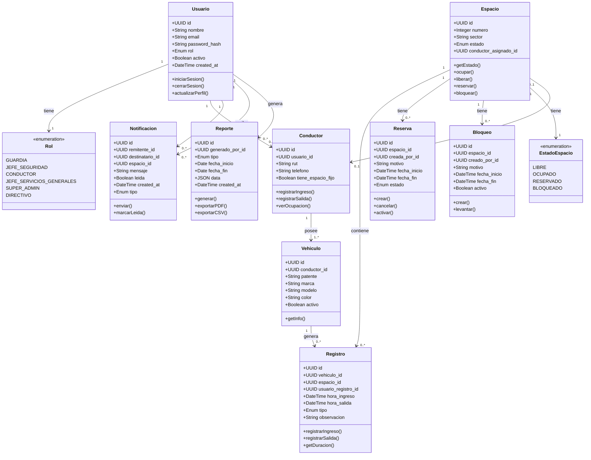
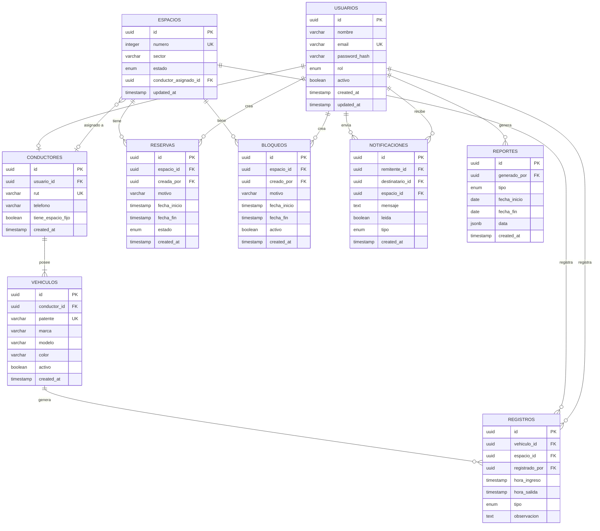
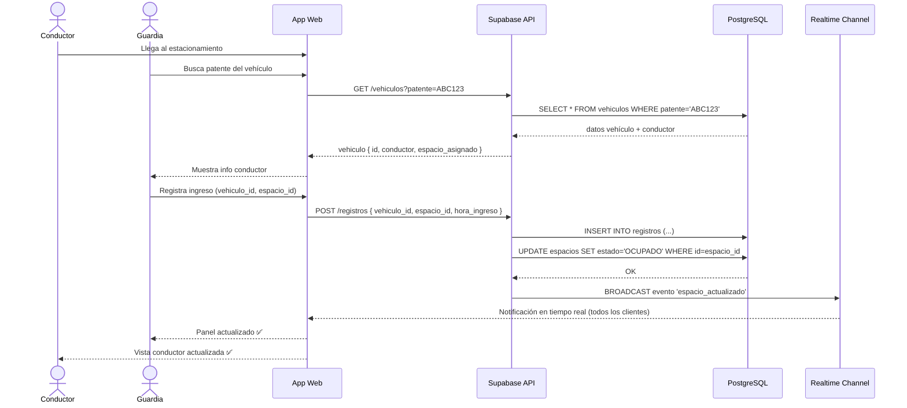
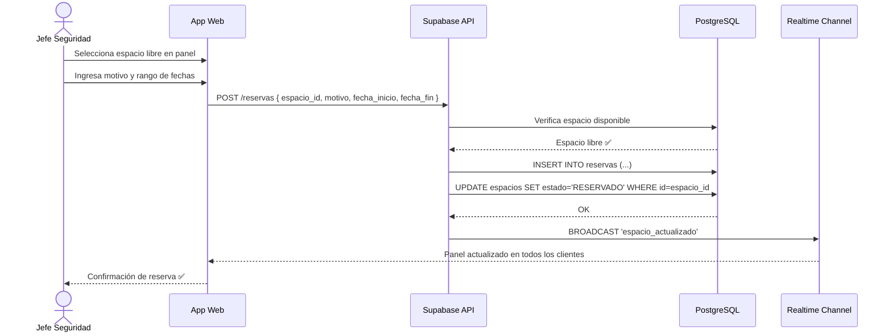
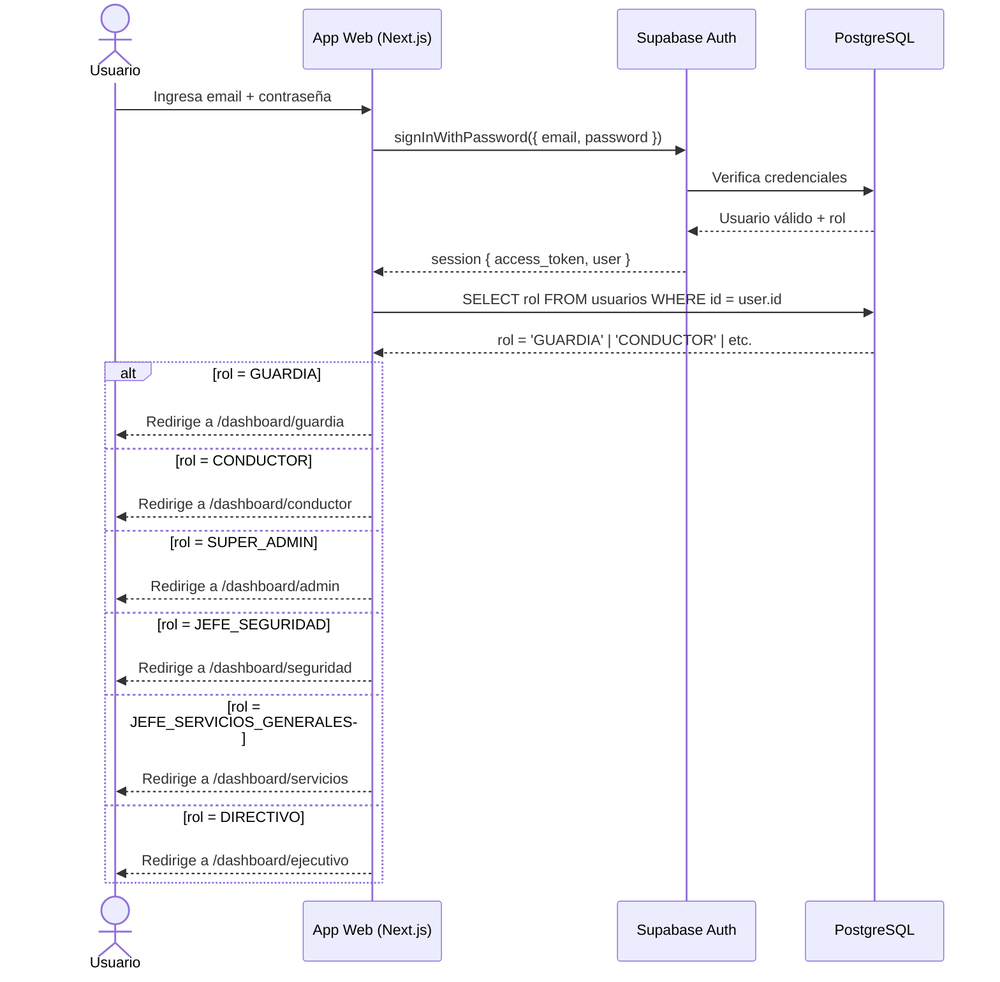

# Modelos UML - Gestión Inteligente de Estacionamientos
## Duoc UC Sede Maipú | BootcampCodecAI | Checkpoint 1

**Equipo:** Diego Gutierrez · Benjamin Mella · Genesis Hernandez  
**Fecha:** 05-06-2026 | **Versión:** 1.0

> 💡 Para visualizar los diagramas: abre este archivo en VS Code con la extensión "Markdown Preview Mermaid Support", o pégalos en https://mermaid.live

---

## 1. Diagrama de Casos de Uso

```mermaid
flowchart TD
    %% Actores
    G([👮 Guardia])
    JS([🔒 Jefe Seguridad])
    C([🚗 Conductor])
    JSG([🏢 Jefe Serv. Generales])
    SA([⚙️ Super Admin])
    D([📊 Directivos])

    %% Sistema
    subgraph SISTEMA["🅿️ Sistema de Gestión de Estacionamientos"]
        
        subgraph AUTH["Autenticación"]
            UC01[Iniciar Sesión]
            UC02[Cerrar Sesión]
        end

        subgraph PANEL["Panel Tiempo Real"]
            UC03[Ver Panel de Ocupación]
            UC04[Ver Estado de Espacios]
            UC05[Buscar Vehículo por Patente]
        end

        subgraph REGISTRO["Registro de Acceso"]
            UC06[Registrar Ingreso Vehículo]
            UC07[Registrar Salida Vehículo]
            UC08[Ver Historial de Ingresos]
        end

        subgraph GESTION["Gestión de Espacios"]
            UC09[Reservar Espacio]
            UC10[Bloquear Espacio]
            UC11[Liberar Espacio]
            UC12[Asignar Espacio Fijo]
        end

        subgraph COMUNICACION["Comunicación"]
            UC13[Enviar Alerta a Conductor]
            UC14[Contactar Guardia]
            UC15[Recibir Notificación]
        end

        subgraph CONDUCTOR_MOD["Módulo Conductor"]
            UC16[Ver Ocupación General]
            UC17[Registrar Mi Ingreso]
            UC18[Registrar Mi Salida]
            UC19[Ver Mi Espacio]
        end

        subgraph ADMIN["Administración"]
            UC20[Enrolar Conductor]
            UC21[Dar de Baja Conductor]
            UC22[Gestionar Usuarios]
            UC23[Asignar Roles]
        end

        subgraph REPORTES["Reportes y Analytics"]
            UC24[Ver Dashboard Ejecutivo]
            UC25[Ver Reportes de Tendencias]
            UC26[Exportar Reportes PDF/CSV]
            UC27[Ver KPIs de Ocupación]
        end

    end

    %% Relaciones Guardia
    G --> UC01
    G --> UC03
    G --> UC04
    G --> UC05
    G --> UC06
    G --> UC07
    G --> UC13

    %% Relaciones Jefe Seguridad
    JS --> UC01
    JS --> UC03
    JS --> UC09
    JS --> UC10
    JS --> UC11
    JS --> UC12
    JS --> UC08

    %% Relaciones Conductor
    C --> UC01
    C --> UC16
    C --> UC17
    C --> UC18
    C --> UC19
    C --> UC14
    C --> UC15

    %% Relaciones Jefe Servicios Generales
    JSG --> UC01
    JSG --> UC25
    JSG --> UC26
    JSG --> UC27
    JSG --> UC22

    %% Relaciones Super Admin
    SA --> UC01
    SA --> UC20
    SA --> UC21
    SA --> UC22
    SA --> UC23
    SA --> UC03

    %% Relaciones Directivos
    D --> UC01
    D --> UC24
    D --> UC27
```



---

## 2. Diagrama de Clases



---

## 3. Diagrama Entidad-Relación (BD)



---

## 4. Diagrama de Secuencia - Ingreso de Vehículo



---

## 5. Diagrama de Secuencia - Reserva de Espacio



---

## 6. Diagrama de Secuencia - Autenticación por Rol



---

## 7. Resumen de Entidades y Estados

### Estados de un Espacio
```
LIBRE → OCUPADO       (ingreso vehículo)
LIBRE → RESERVADO     (jefe crea reserva)
LIBRE → BLOQUEADO     (jefe crea bloqueo)
OCUPADO → LIBRE       (salida vehículo)
RESERVADO → LIBRE     (reserva cancelada/expirada)
RESERVADO → OCUPADO   (vehículo ingresa en reserva)
BLOQUEADO → LIBRE     (bloqueo levantado)
```

### Roles y sus Dashboards
| Rol | Dashboard | Acceso |
|-----|-----------|--------|
| GUARDIA | `/dashboard/guardia` | Panel + Registro ingreso/salida |
| JEFE_SEGURIDAD | `/dashboard/seguridad` | Panel + Reservas + Bloqueos |
| CONDUCTOR | `/dashboard/conductor` | Ocupación + Mi espacio + Mensajes |
| JEFE_SERVICIOS_GENERALES | `/dashboard/servicios` | Reportes + Gestión |
| SUPER_ADMIN | `/dashboard/admin` | Todo |
| DIRECTIVO | `/dashboard/ejecutivo` | Solo lectura - KPIs |
